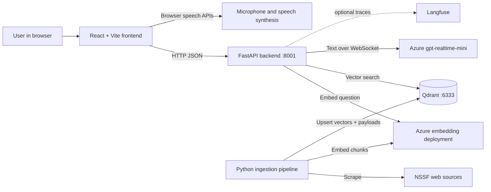
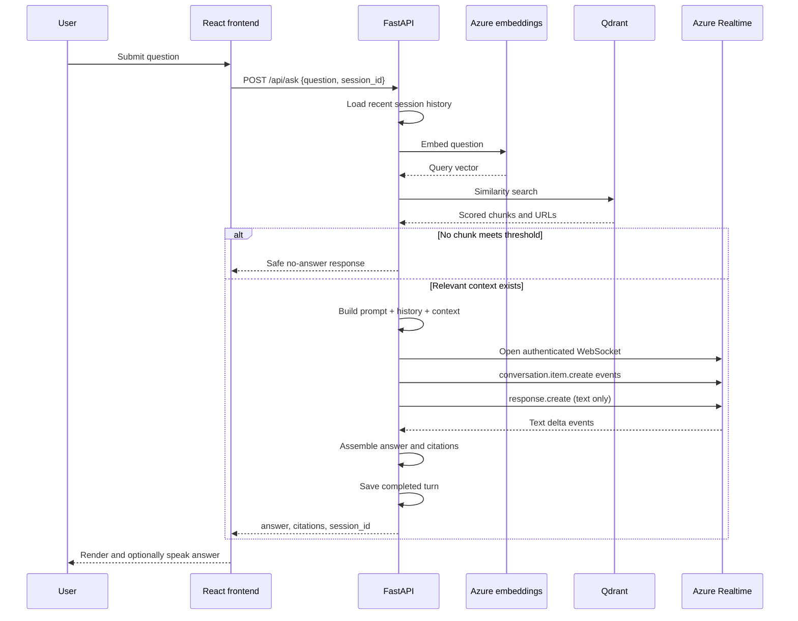
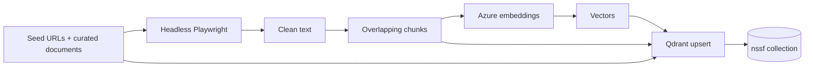

# NSSF Assistant (Nicky): Complete Architecture Documentation

## 1. Purpose

Nicky is a retrieval-augmented generation (RAG) chatbot for NSSF Uganda. It
retrieves relevant passages collected from NSSF sources and instructs an Azure
OpenAI Realtime model to answer from those passages. The project includes a
React interface, FastAPI service, offline ingestion pipeline, Qdrant vector
search, conversation memory, citations, browser speech, and optional Langfuse
monitoring.

The design separates two workloads:

1. **Offline ingestion** collects, chunks, embeds, and indexes NSSF content.
2. **Online answering** embeds a question, retrieves relevant chunks, and
   generates a grounded response.

## 2. System Context



During development, the frontend and ingestion process run on the host. Docker
Compose runs FastAPI and Qdrant. Azure and Langfuse are external services.

## 3. Technology Stack

| Layer | Technology | Responsibility |
|---|---|---|
| Web UI | React 19, TypeScript, Vite | Chat UI, browser persistence and voice |
| API | FastAPI, Uvicorn, Pydantic | Routes, validation and orchestration |
| Retrieval | Qdrant | Persistent vector storage and similarity search |
| Embeddings | Azure `text-embedding-3-small` deployment | Document/query vectors |
| Generation | Azure `gpt-realtime-mini` | Grounded text over Realtime WebSocket |
| Ingestion | Python, Playwright, Azure OpenAI SDK | Scrape, chunk, embed and index |
| Monitoring | Langfuse (optional) | Chat traces and feedback |
| Runtime | Docker Compose | Backend and Qdrant containers |

## 4. Repository Structure

```text
Chatbot/
|-- .env                     Local secrets/configuration (do not commit)
|-- .env.example             Configuration template
|-- docker-compose.yml       Qdrant and backend services
|-- ARCHITECTURE.md          This document
|-- README.md                Quick start
|-- frontend/
|   |-- src/App.tsx          Active UI and REST integration
|   |-- src/utils/speech.ts  Browser speech input/output
|   |-- src/hooks/chat.ts    Alternative SSE chat hook
|   `-- vite.config.ts       Development proxy
|-- backend/
|   |-- Dockerfile
|   |-- requirements.txt
|   `-- app/
|       |-- main.py          FastAPI app and routes
|       |-- rag.py           Embedding, retrieval, prompt and generation
|       |-- config.py        Environment-backed settings
|       |-- memory.py        In-process conversation memory
|       |-- schemas.py       API models
|       |-- realtime.py      Realtime connectivity diagnostic
|       `-- monitoring.py    Optional Langfuse integration
`-- ingestion/
    |-- ingest.py            Offline scrape-to-Qdrant pipeline
    `-- requirements.txt
```

`backend/ui.py`, `backend/web_ui.py`, `backend/web_uic.py`,
`backend/assistant.py`, root `main.py`, and `backend/chat_db.py` are older or
alternative interfaces. They are not imported by the active Dockerized React
and FastAPI application.

## 5. Online Question-Answering Flow

The active React UI calls `POST /api/ask`:



### 5.1 Retrieval

`backend/app/rag.py` embeds each question with the Azure embedding deployment.
It searches the Qdrant collection using:

- `TOP_K` candidates (default 5)
- `SCORE_THRESHOLD` filtering (default 0.2)
- payloads containing source text and URL

Online queries must use the same embedding model as ingestion. Switching
embedding models can change vector dimensions and meaning, so the collection
must be re-ingested after such a change.

### 5.2 Prompt and grounding

`SYSTEM_PROMPT` in `rag.py` controls identity, tone, grounding, and safety.
Retrieved chunks are appended as NSSF context. Recent messages support
follow-up questions. If no result meets the threshold, `NO_ANSWER` is returned
without calling the generation model.

### 5.3 Realtime generation

The application uses `gpt-realtime-mini` over Azure Realtime WebSockets because
the available deployment does not support Chat Completions. Prompt messages are
sent as conversation items, followed by a text-only `response.create` event.

Content types are role-sensitive:

- System and user messages use `input_text`.
- Previous assistant messages use `text`.
- The deployment uses temperature `0.6`, its supported minimum.

Each answer currently opens a new WebSocket. The backend assembles the deltas
and returns complete JSON through `/api/ask`; `/chat` exposes SSE streaming.

### 5.4 Conversation memory

`SessionMemory` stores recent messages inside the backend process:

- A UUID identifies a session.
- The first request omits `session_id`; the backend returns one.
- At most `MAX_TURNS * 2` messages are retained.
- Sessions expire after `SESSION_TTL_SECONDS`.
- A lock protects memory from concurrent access.

Memory is lost when the container restarts and is not shared across replicas.
Production scaling should use Redis or another shared store.

The frontend separately stores displayed conversations in browser
`localStorage`. That survives page refreshes but cannot restore backend context
after backend memory expires or restarts.

## 6. Offline Ingestion

`ingestion/ingest.py` is a batch job and is not started by Compose.



The pipeline:

1. Loads `.env` from the project root.
2. Includes curated high-value NSSF documents.
3. Opens seed pages in headless Chromium.
4. Scrolls pages to render lazy-loaded content.
5. Extracts and normalizes visible text.
6. Creates overlapping chunks.
7. Embeds chunks with Azure.
8. Creates the collection using the detected vector size when absent.
9. Upserts vectors with `text`, `url`, and `source` payload fields.

Run it during initial setup, after changing embedding models or collections,
and whenever source material needs refreshing.

## 7. Frontend Architecture

The active UI is `frontend/src/App.tsx`.

### State and persistence

- React state holds conversations, active conversation, input, loading state,
  backend status, microphone state, and voice preference.
- Conversations use `nssf_conversations` in `localStorage`.
- The active ID uses `nssf_active_id`.
- `AbortController` cancels an earlier browser request when necessary.

### Backend interaction

- `GET /api/status` is polled for Online/Connecting state.
- `POST /api/ask` sends `{question, session_id}`.
- Non-2xx responses are handled as backend errors.
- Development API base: `http://127.0.0.1:8001`.

Production should replace the hard-coded API address with an environment
variable or relative `/api` path behind a reverse proxy.

### Voice

Voice uses browser APIs rather than Azure audio:

- Speech recognition converts microphone input to text.
- Speech synthesis reads assistant responses.
- Microphone permission is required.
- Chrome and Edge generally offer the best support.
- Remote microphone access normally requires HTTPS; localhost is allowed as a
  secure development context by supported browsers.

## 8. Backend API

| Method | Route | Purpose |
|---|---|---|
| GET | `/health` | Process health: `{"status":"ok"}` |
| GET | `/api/status` | Frontend availability: `{"ready":true}` |
| POST | `/api/ask` | Complete JSON answer, citations and session ID |
| POST | `/chat` | SSE token and completion events |
| GET | `/chat/history/{session_id}` | Current in-memory history |
| POST | `/feedback` | Optional Langfuse feedback |
| POST | `/realtime/session` | Diagnostic Realtime connection |
| GET | `/docs` | Generated Swagger UI |

The active `App.tsx` uses `/api/status` and `/api/ask`. The alternative
`frontend/src/hooks/chat.ts` uses `/chat`.

## 9. Docker and Networking

### Qdrant service

- Image: `qdrant/qdrant:latest`
- Port mapping: `6333:6333`
- Persistent volume: `qdrant_data`

### Backend service

- Built from `backend/Dockerfile`
- Uvicorn listens on container port 8001
- Port mapping: `8001:8001`
- Loads root `.env`
- Uses `QDRANT_URL=http://qdrant:6333` internally
- Depends on Qdrant

`depends_on` orders startup but does not guarantee readiness. Production should
add service health checks and retries.

The frontend is not a Compose service. Vite normally runs on host port 5173.

## 10. Configuration

Never commit `.env` or credentials. Rotate any key exposed in chat, logs,
screenshots, or source control.

| Variable | Required | Description |
|---|---:|---|
| `AZURE_OPENAI_ENDPOINT` | Yes | Realtime resource endpoint |
| `AZURE_OPENAI_API_KEY` | Yes | Realtime resource key |
| `AZURE_OPENAI_DEPLOYMENT` | Yes | Realtime deployment name |
| `AZURE_OPENAI_API_VERSION` | Yes | Realtime API version |
| `AZURE_EMBED_ENDPOINT` | Yes | Embedding resource endpoint |
| `AZURE_EMBED_API_KEY` | Yes | Embedding resource key |
| `AZURE_EMBED_DEPLOYMENT` | Yes | Exact embedding deployment name |
| `AZURE_EMBED_API_VERSION` | Yes | Embedding API version |
| `QDRANT_URL` | Usually | Qdrant URL; Compose overrides it for backend |
| `COLLECTION` | No | Collection name, default `nssf` |
| `TOP_K` | No | Retrieved candidates, default 5 |
| `SCORE_THRESHOLD` | No | Minimum similarity, default 0.2 |
| `MAX_TURNS` | No | Recent turns, default 8 |
| `SESSION_TTL_SECONDS` | No | Session TTL, default 3600 seconds |
| `LANGFUSE_PUBLIC_KEY` | No | Optional monitoring key |
| `LANGFUSE_SECRET_KEY` | No | Optional monitoring secret |
| `LANGFUSE_HOST` | No | Langfuse URL |

`AZURE_CHAT_*` variables are reserved for a future Chat Completions deployment;
the current generation path uses the `AZURE_OPENAI_*` Realtime settings.

## 11. Setup and Operation

### Start backend and Qdrant

```powershell
docker compose up -d --build
docker compose ps
```

```powershell
Invoke-RestMethod http://localhost:8001/health
Invoke-RestMethod http://localhost:8001/api/status
```

### Run ingestion

```powershell
cd ingestion
pip install -r requirements.txt
playwright install chromium
python ingest.py
```

### Start frontend

```powershell
cd frontend
npm install
npm run dev
```

Open the Vite URL, normally `http://localhost:5173`.

### Test without the UI

```powershell
Invoke-RestMethod `
  -Method Post `
  -Uri http://localhost:8001/api/ask `
  -ContentType "application/json" `
  -Body '{"question":"What is NSSF?","session_id":null}'
```

## 12. Monitoring and Troubleshooting

```powershell
docker compose ps -a
docker compose logs --tail 200 backend
docker compose logs -f backend
```

| Symptom | Likely cause | Resolution |
|---|---|---|
| `404` at `/` | No root route | Use `/docs`, `/health`, or an API route |
| `DeploymentNotFound` | Wrong embedding deployment/endpoint | Check exact `AZURE_EMBED_*` values |
| Vector dimension error | Different ingestion/query models | Recreate and re-ingest collection |
| Unsupported operation | Realtime model called via Chat Completions | Use the Realtime generation path |
| `input_text` must be `text` | Assistant history has wrong content type | Preserve role-specific types |
| Frontend cannot connect | Hidden backend error or wrong address | Check browser Network tab and logs |
| Backend exits | Missing setting or import error | Inspect `docker compose logs backend` |
| Voice fails | Permission/browser/insecure HTTP | Allow mic, use Chrome/Edge and HTTPS |

Langfuse is defensive: monitoring failures are logged and should not stop chat.

## 13. Security and Production Readiness

Before production:

1. Restrict CORS instead of allowing every origin.
2. Store secrets in a managed secret store.
3. Use HTTPS and an authenticated reverse proxy.
4. Add rate limits, request limits, timeouts, and structured errors.
5. Replace in-memory sessions with Redis/shared storage.
6. Pin the Qdrant image version rather than `latest`.
7. Add Docker health checks and Qdrant retry logic.
8. Do not expose upstream error details publicly.
9. Define retention/privacy rules for conversations and traces.
10. Add automated API, retrieval, multi-turn, and grounding tests.

## 14. Extension Points

- Edit response behavior in `SYSTEM_PROMPT` and `NO_ANSWER` in `rag.py`.
- Tune retrieval using `TOP_K` and `SCORE_THRESHOLD`.
- Edit ingestion sources in `SEED_URLS` and `CURATED_DOCS`.
- Replace browser speech with Azure Realtime speech-to-speech audio.
- Serve the built frontend through Nginx and proxy `/api` to FastAPI.
- Add hybrid vector/keyword retrieval and reranking.
- Schedule ingestion and use versioned Qdrant collections.

## 15. Current Limitations

- `/api/ask` returns only after assembling the full answer; the active UI does
  not yet consume the available `/chat` SSE stream.
- A new Azure WebSocket is opened for each generated answer.
- Frontend display persistence and backend context have different lifetimes.
- There is no authentication or per-user authorization.
- Qdrant collections have no migration/version alias workflow.
- The frontend API address is development-specific and hard-coded.
- Legacy interfaces remain in the repository and should eventually be archived.

