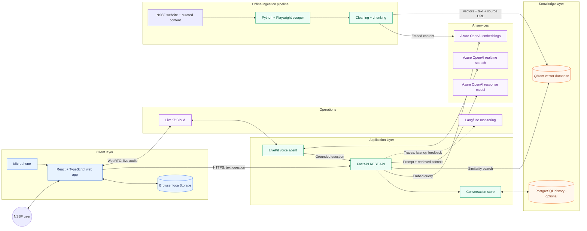
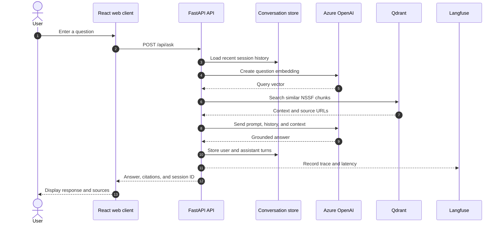
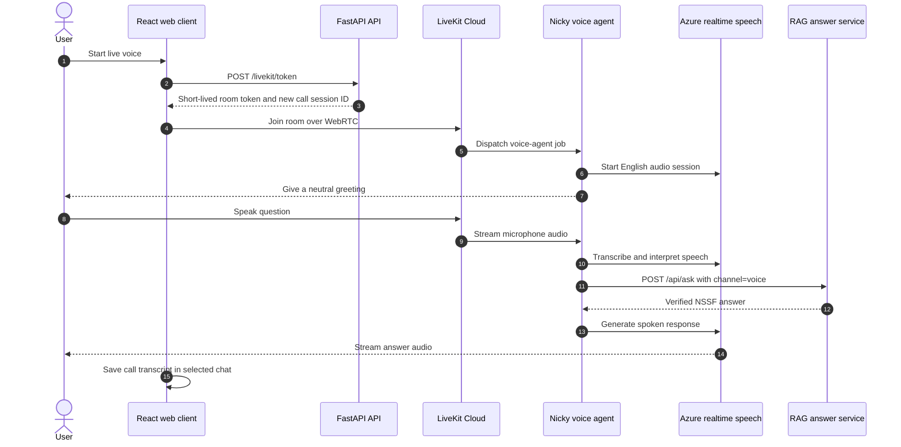
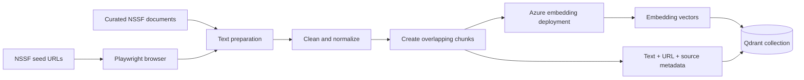
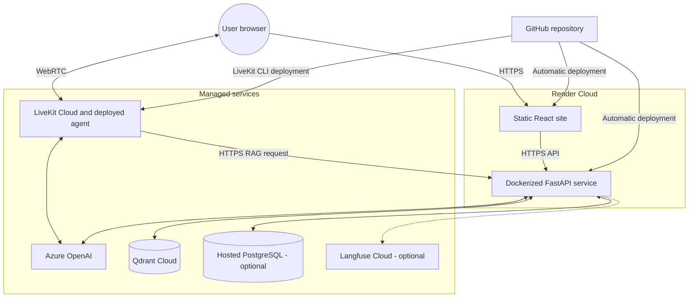

# Nicky — NSSF Uganda Chatbot Architecture

## 1. Architecture overview

Nicky is a multimodal retrieval-augmented generation (RAG) assistant for NSSF
Uganda. Users can communicate through typed chat, microphone dictation, or a
real-time LiveKit voice call. Answers are grounded in NSSF information stored
in Qdrant, while Azure OpenAI provides embeddings, response generation,
transcription, and speech.

The solution has two distinct paths:

- **Knowledge ingestion:** NSSF content is collected, cleaned, divided into
  chunks, converted into embeddings, and stored in Qdrant.
- **Conversation serving:** A user question is embedded, matched against
  Qdrant, combined with relevant context, and sent to Azure OpenAI to produce
  a grounded answer.

## 2. High-level system architecture



### Architectural style

The system combines layered web architecture, retrieval-augmented generation,
event-driven real-time voice communication, batch data processing, and managed
cloud services.

## 3. Core components

| Component | Technology | Main responsibility |
|---|---|---|
| Web client | React, TypeScript, Vite | Presents chat history, accepts typed or dictated questions, starts voice calls, and displays citations |
| API service | FastAPI, Pydantic, Uvicorn | Validates requests, manages sessions, orchestrates retrieval and generation, and issues short-lived LiveKit tokens |
| RAG service | Python, Azure OpenAI SDK | Embeds questions, retrieves context, constructs prompts, and generates grounded answers |
| Vector database | Qdrant | Stores NSSF content embeddings and performs similarity search |
| Conversation store | PostgreSQL with in-memory fallback | Stores recent text and voice conversation turns |
| Voice agent | LiveKit Agents SDK | Manages calls, English transcription, speech responses, and verified RAG requests |
| Ingestion pipeline | Python, Playwright | Scrapes NSSF pages, cleans and chunks text, embeds it, and updates Qdrant |
| AI platform | Azure OpenAI | Provides embeddings, generated responses, transcription, and speech synthesis |
| Monitoring | Langfuse | Records traces, latency, channel, citations, sessions, and feedback when configured |
| Hosting | Render and LiveKit Cloud | Hosts the web/API services and managed voice worker |

## 4. Text conversation flow



The browser stores displayed conversations in `localStorage`. The backend
stores conversational context separately, using PostgreSQL when
`DATABASE_URL` is configured and an in-memory fallback otherwise.

## 5. Live voice conversation flow



Each voice call receives a new backend session ID. This prevents a new call
from inheriting the topic or response context of a previous call. The completed
transcript can still be added to the selected conversation in the web UI.

## 6. Knowledge ingestion flow



Ingestion is an offline administrative process. It is run during initial
setup, after changing the embedding model, and whenever NSSF source material
needs to be refreshed. The same embedding deployment must be used for both
stored documents and live questions.

## 7. Production deployment architecture



### Deployment responsibilities

- **Render static service:** builds and publishes the Vite frontend.
- **Render web service:** builds the backend Docker image and exposes the API.
- **LiveKit Cloud:** runs the voice-agent worker and transports live audio.
- **Qdrant:** retains the searchable NSSF knowledge base.
- **PostgreSQL:** retains conversation history when configured.
- **Langfuse:** receives optional observability data without interrupting chat.

## 8. Main API interfaces

| Method | Endpoint | Purpose |
|---|---|---|
| `GET` | `/health` | Hosting health check |
| `GET` | `/api/status` | Reports backend, history, and monitoring readiness |
| `POST` | `/api/ask` | Returns a complete grounded answer with citations |
| `POST` | `/chat` | Streams answer events using server-sent events |
| `GET` | `/chat/history/{session_id}` | Retrieves stored backend conversation history |
| `POST` | `/feedback` | Records user feedback |
| `POST` | `/livekit/token` | Creates a short-lived, room-scoped voice token |

## 9. Security and reliability controls

- LiveKit API secrets remain on the backend; browsers receive only
  short-lived room tokens.
- Azure, Qdrant, database, and Langfuse secrets are supplied through server
  environment variables and must not be included in frontend variables.
- CORS restricts production browser access to the deployed frontend origin.
- RAG grounding tells the model to use retrieved NSSF content and avoid
  inventing policies, figures, or personal account details.
- Monitoring is failure-isolated: missing keys or a Langfuse outage cannot
  stop a response.
- PostgreSQL failures fall back to in-memory history so the API remains
  available, although persistence is temporarily lost.
- Every voice call uses an isolated session to prevent context leakage.

## 10. Current limitations and recommended improvements

| Current limitation | Recommended improvement |
|---|---|
| The active text UI waits for the complete `/api/ask` response | Adopt the existing `/chat` SSE endpoint for visible token streaming |
| In-memory history is used when no database is configured | Configure managed PostgreSQL in every production environment |
| Ingestion is manually initiated | Schedule ingestion and record content/index versions |
| Qdrant uses a single active collection | Introduce versioned collections and aliases for safe index updates |
| The backend and voice worker depend on external AI services | Add retry policies, timeout metrics, and user-friendly degraded responses |
| There is no end-user authentication | Add identity and authorization before exposing account-specific features |
| The frontend bundle is large | Load LiveKit voice code only when a call starts |

## 11. Exporting the diagrams

The diagrams use Mermaid, which GitHub renders directly. A standalone copy of
the main diagram is available at
[`docs/system-architecture.mmd`](docs/system-architecture.mmd).

Export options:

1. Paste the `.mmd` file into <https://mermaid.live> and select **Actions →
   Export** to download SVG, PNG, or PDF.
2. With Mermaid CLI, run:

   ```powershell
   npx --yes @mermaid-js/mermaid-cli `
     -i docs/system-architecture.mmd `
     -o docs/system-architecture.svg `
     -b transparent
   ```

SVG is recommended for a report because it remains sharp when resized.
